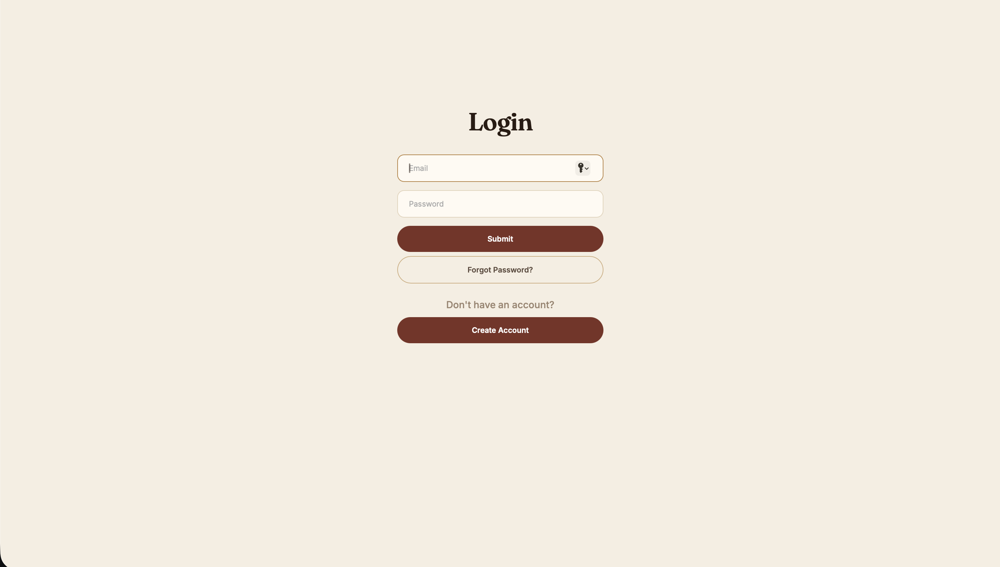
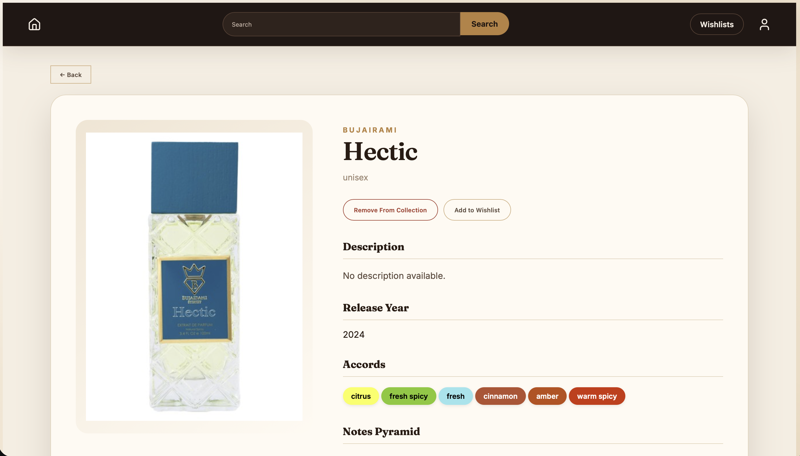
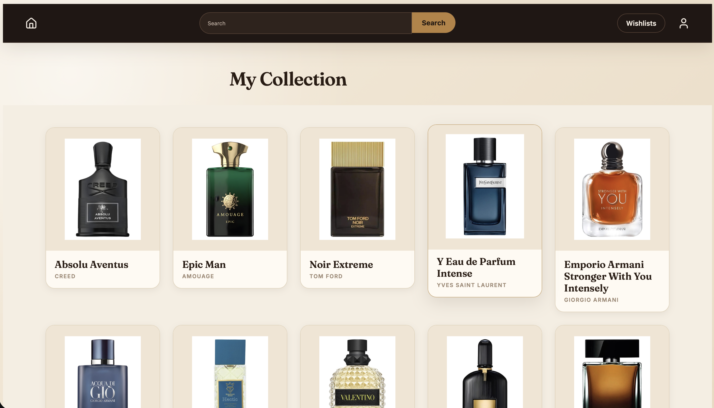
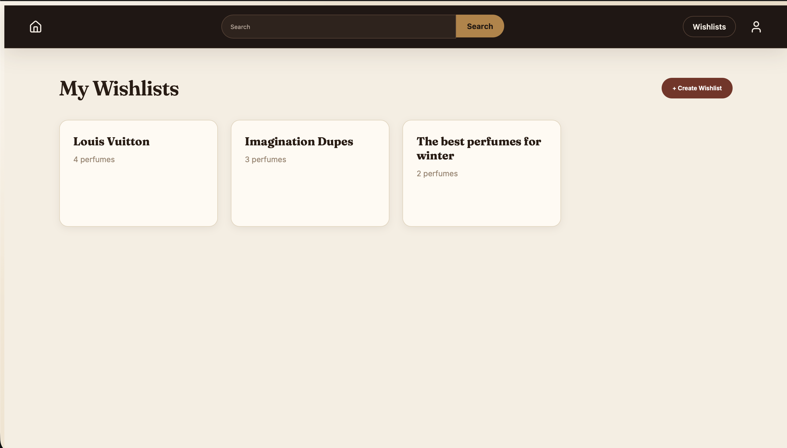
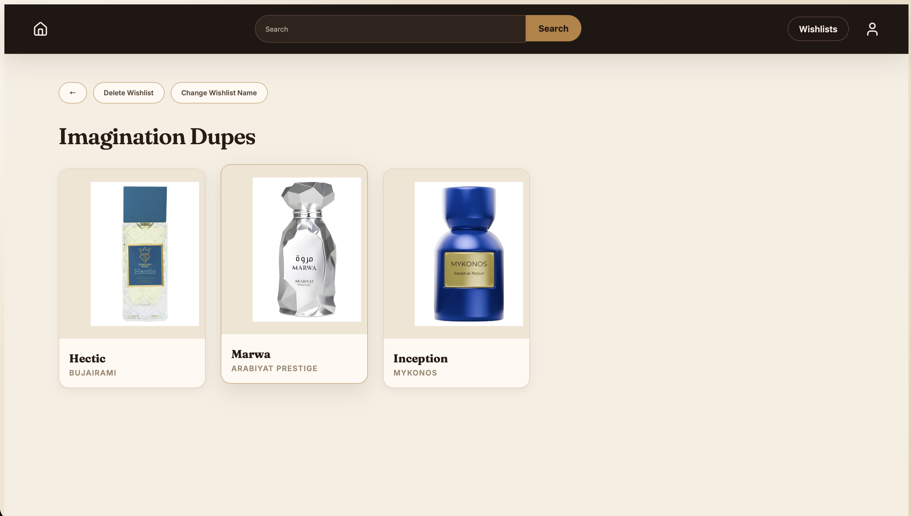
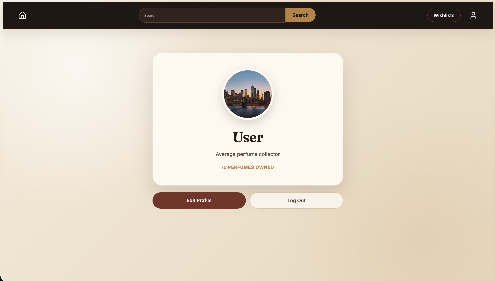
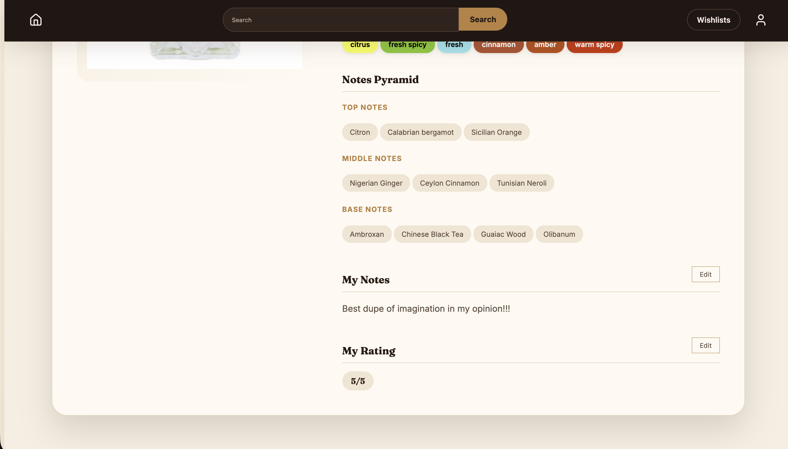

# Perfume Project

A full-stack web app for tracking and discovering perfumes. Register an account, search for
perfumes (backed by a live scraper for anything not already in the database), add them to your
personal collection with private notes and ratings, and organize ones you want into named
wishlists.

## Screenshots


## Screenshots

| Login | Create Account | Search |
|---|---|---|
|  |  |  |

| Perfume Detail | Collection | Wishlists |
|---|---|---|
|  |  |  |

| Wishlist Perfumes | Profile | Perfume Opinion |
|---|---|---|
|  |  |  |

## Features

- **Auth** — registration with email verification, login, JWT sessions, forgot/reset password,
  all with a real hashed-password flow (Argon2 via `pwdlib`).
- **Search** — look up any perfume by name; if it's not already in the local database, the
  backend scrapes it live via an Apify actor and caches the result for future searches.
- **Collection** — add perfumes you own, attach private notes and a 0–10 rating, edit or remove
  them later.
- **Wishlists** — create multiple named wishlists, add/remove perfumes to each, rename or
  delete a wishlist.
- **Profile** — view your own profile or another user's, with an editable bio and profile
  picture.

## Tech stack

**Backend:** Python, FastAPI, SQLAlchemy, PostgreSQL, Pydantic, JWT (`python-jose`), `pwdlib`
(Argon2 password hashing), Resend (transactional email), `uv` for dependency management.

**Frontend:** React, React Router, Vite, `lucide-react`.

**External services:** Apify (perfume scraping), Resend (email delivery).

## Getting started

### Prerequisites

- Python 3.9+ and [`uv`](https://docs.astral.sh/uv/)
- Node.js 18+
- A running PostgreSQL instance
- An Apify API token and a Resend API key (only required for the search-scraping and
  email-sending features respectively — the rest of the app runs without them)

### Backend

```bash
cd backend
uv sync
```

Create a `.env` file inside `backend/` with:


SECRET_KEY=your-jwt-signing-secret
APIFY_TOKEN=your-apify-token
RESEND_API_KEY=your-resend-api-key


Then run:

```bash
uv run python __init__.py
```

The API runs at `http://localhost:9000`.

### Frontend

```bash
cd frontend
npm install
npm run dev
```

The app runs at `http://localhost:5173`.

## API overview

| Area | Endpoints |
|---|---|
| Accounts | `POST /register`, `POST /login`, `PUT /me/account`, `DELETE /me/account`, `POST /verify-email`, `POST /forgot-password`, `POST /reset-password` |
| Perfumes | `GET /perfumes/search?q=`, `GET /perfumes/{perfume_id}` |
| Collection | `GET /me/collection`, `POST /me/collection/{perfume_id}`, `GET /me/collection/{item_id}`, `PUT /me/collection/{item_id}`, `PUT /me/collection/{item_id}/rating`, `DELETE /me/collection/{item_id}` |
| Wishlists | `GET /me/wishlists`, `POST /me/wishlists`, `PUT /me/wishlists/{wishlist_id}`, `DELETE /me/wishlists/{wishlist_id}`, `POST /me/wishlists/{wishlist_id}/{perfume_id}`, `DELETE /me/wishlists/{wishlist_id}/{perfume_id}`, `GET /me/wishlists/{wishlist_id}` |
| Profile | `GET /me/profile`, `GET /profile/{username}`, `POST /me/profile-picture` |

All `/me/*` routes require an `Authorization: Bearer <token>` header, obtained from `/login` or
`/register`.

## Roadmap

- Automated test suite
- Move hardcoded config (DB URL, frontend API base URL) into environment variables

## Author

Tarig Bashari